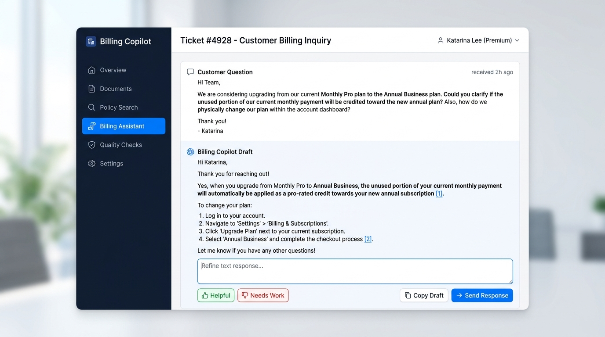
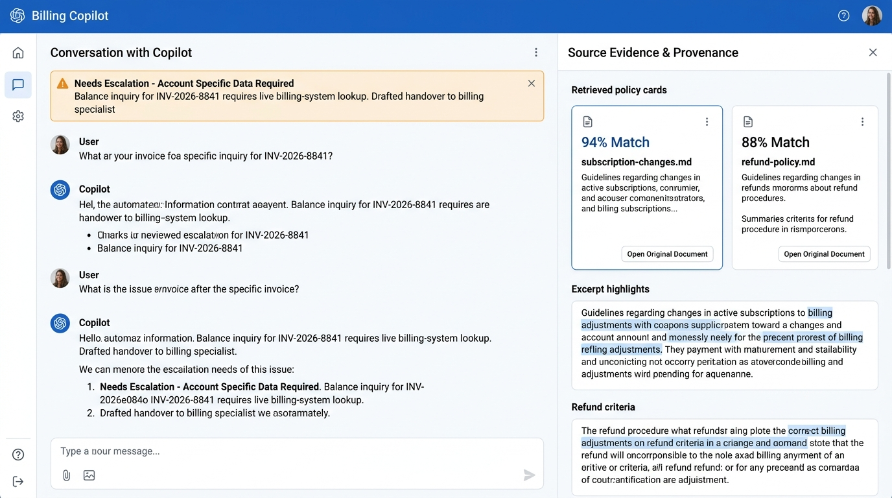
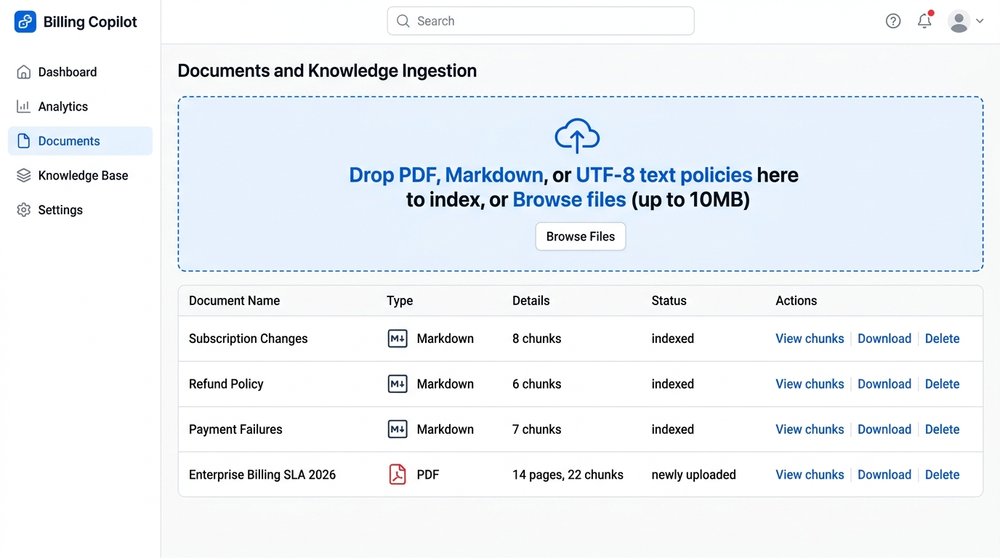
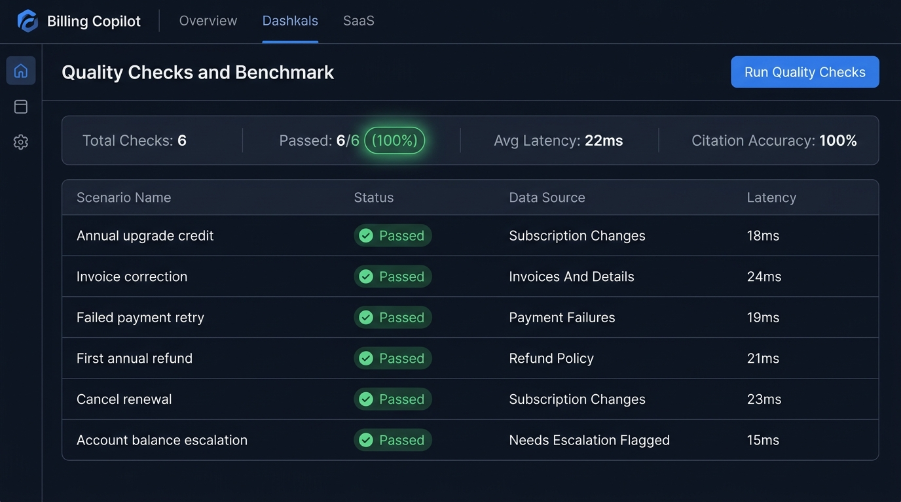

# Billing Copilot

A billing support demo for subscription businesses, using the original blue-and-white interface: sidebar, chat bubbles, and retrieval inspector.

Agents ask about invoices, payment failures, subscription changes, and refunds. The app searches uploaded policies, prepares a draft with real source references, and routes account-specific questions to a billing specialist.

## Run the working demo

Use Python 3.12. From this project folder in PowerShell:

```powershell
python -m venv .venv
./.venv/Scripts/python.exe -m pip install -r requirements-demo.txt
./start-demo.ps1
```

Open **http://127.0.0.1:8000/** and keep the terminal open. To use another port: `./start-demo.ps1 -Port 8001`.

The demo needs no API key, model download, Docker, or PostgreSQL. Five fictional Northstar Cloud billing policies are indexed automatically on first startup. Documents, conversations, and feedback persist in `.data/billing-demo.sqlite3`.

## End-to-End Demo Walkthrough

Billing Copilot provides a complete end-to-end evidence-backed workflow for customer billing support teams. This walkthrough covers both the **interactive Web UI** and the **underlying REST API**.

```
┌─────────────────┐       ┌──────────────────────┐       ┌──────────────────────┐
│ Customer Ticket │ ───>  │  Billing Assistant   │ ───>  │  Source Evidence     │
│ Selection/Query │       │  (Citations & Draft) │       │  (Drawer & Document) │
└─────────────────┘       └──────────────────────┘       └──────────────────────┘
         │                           │                              │
         ▼                           ▼                              ▼
┌─────────────────┐       ┌──────────────────────┐       ┌──────────────────────┐
│ Safe Escalation │       │ Quality Benchmarks   │       │ Document Ingestion   │
│ Trigger Guard   │       │ (Automated Audits)   │       │ (Instant Indexing)   │
└─────────────────┘       └──────────────────────┘       └──────────────────────┘
```

### 1. Interactive Web UI Flow

1. **Policy-Grounded Drafting with Inline Citations**:
   - Navigate to the **Billing Assistant** tab (`#nav-chat`).
   - Click any sample customer ticket (e.g., *"Switch from monthly to annual"* or *"A renewal payment failed"*), or type a custom question.
   - The assistant performs hybrid retrieval across the indexed knowledge base and produces a concise draft containing bracketed citation tags (`[1]`, `[2]`).
   - Click or hover on citations to immediately see the supporting excerpt.

   

2. **Source Evidence & Original Document Inspector**:
   - The right-side **Source Evidence** panel lists each retrieved source snippet, match rank, and source document name (e.g. `subscription-changes.md`, `payment-failures.md`).
   - Click **Open original document** to view the unabridged policy text in a side-drawer and verify exact source wording.

3. **Safe Escalation Guard for Account-Specific Inquiries**:
   - Select the sample ticket: *"An account-specific billing question"* or ask *"What is the exact balance on invoice INV-2026-8841?"*.
   - Because invoice balance lookups require live payment processor credentials (e.g. Stripe/accounting portal), the engine guards against hallucination.
   - It flags `status: needs_escalation`, displays an amber escalation banner, and prepares a routed transfer note for human billing specialists.

   

4. **Dynamic Knowledge Ingestion**:
   - Switch to the **Documents** tab (`#nav-documents`).
   - Upload any `.pdf`, `.md`, or `.txt` policy file via drag-and-drop or file selector.
   - The document is validated, extracted, and indexed instantly without restarting the server.
   - Queries regarding newly added terms are immediately retrievable.

   

5. **Automated Quality & Audit Checks**:
   - Switch to the **Quality Checks** tab (`#nav-evaluation`).
   - Click **Run Quality Checks**.
   - The suite runs 6 automated billing test scenarios, validating retrieval accuracy, behavior compliance (draft vs. escalation), citation validity, and response latency.

   

6. **Capacity Planning Calculator**:
   - Open the **Overview** tab (`#nav-overview`).
   - Modify ticket volume, average resolution time, and expected deflection rates to interactively calculate monthly capacity hours returned to your team.

---

### 2. End-to-End API Walkthrough (cURL Examples)

The backend provides a clean REST and SSE API for integrations.

#### Health Check
```bash
curl -X GET http://127.0.0.1:8000/health
```
```json
{
  "status": "healthy",
  "mode": "demo",
  "checks": { "database": true },
  "note": "Provider inference is checked when generating a draft."
}
```

#### Retrieve Evidence & Draft Reply
```bash
curl -X POST http://127.0.0.1:8000/api/chat \
  -H "Content-Type: application/json" \
  -d '{
    "message": "Will an annual upgrade credit our unused monthly payment?",
    "search_type": "hybrid"
  }'
```
```json
{
  "draft_id": "draft_abc123",
  "session_id": "sess_xyz789",
  "status": "draft",
  "message": "When switching from monthly to annual billing, any unused time on the current monthly subscription is credited toward the annual plan [1].",
  "sources": [
    {
      "id": 1,
      "title": "Subscription Changes",
      "text": "When switching from monthly to annual billing, any unused time...",
      "page": null
    }
  ],
  "citation_check": {
    "references_valid": true,
    "referenced_ids": [1]
  },
  "elapsed_ms": 18
}
```

#### Real-Time SSE Stream
```bash
curl -N -X POST http://127.0.0.1:8000/api/chat/stream \
  -H "Content-Type: application/json" \
  -d '{
    "message": "When does a failed renewal retry?",
    "search_type": "hybrid"
  }'
```

#### Direct Policy Search (Hybrid / Vector)
```bash
curl -X POST http://127.0.0.1:8000/api/search/hybrid \
  -H "Content-Type: application/json" \
  -d '{
    "query": "grace period for failed payments",
    "limit": 3
  }'
```

#### Upload New Policy Document
```bash
curl -X POST http://127.0.0.1:8000/api/documents \
  -F "file=@sample_data/billing/refund-policy.md"
```

#### Run Automated Quality Benchmark
```bash
curl -X POST http://127.0.0.1:8000/api/benchmark/run
```

#### Submit Reviewer Feedback
```bash
curl -X POST http://127.0.0.1:8000/api/drafts/draft_abc123/feedback \
  -H "Content-Type: application/json" \
  -d '{"value": "helpful"}'
```

## What works

- Billing assistant with six sample customer questions and follow-up context.
- Real policy retrieval, inline citations, original-document viewer, editable replies, and feedback.
- PDF, Markdown, and text uploads with validation, duplicate detection, and PDF page references.
- Six repeatable billing checks that report actual outcomes and retrieved evidence.
- A planning calculator with editable assumptions.
- Connected mode with PostgreSQL, pgvector, reciprocal rank fusion, and a configured AI provider.
- Access-key roles, conversation ownership, upload limits, and explicit service errors.

**Demo replies are extracts from policy text**, clearly labeled in the interface. Connected mode uses an LLM. Citation checks validate reference IDs; they do not establish factual accuracy. All replies require human review.

This app does not connect to Stripe or accounting software, charge cards, issue refunds, change subscriptions, or send customer messages. Account balances and transaction status require an authorized billing-system lookup.

## Present it to a client

Start with **Billing Assistant**, inspect a cited policy, upload a sample policy, and run **Quality Checks**. See [the five-minute client demo](docs/CLIENT_DEMO.md) for a walkthrough and a realistic paid-pilot scope.

## Connect a client workspace

1. Install `requirements-live.txt`.
2. Copy `.env.example` to `.env` and configure `APP_MODE=live`, workspace access keys, PostgreSQL, and your model providers.
3. Provide PostgreSQL with the pgvector extension. Startup initializes a new schema or applies the retrieval migration to an existing schema without dropping data tables.
4. Match the embedding model's output to the supplied **384-dimensional** schema. Local SentenceTransformer embeddings require a separate `pip install sentence-transformers`. Ollama requires a running Ollama server and the selected models.
5. Run `./.venv/Scripts/python.exe -m uvicorn app.api:app --host 127.0.0.1 --port 8000`.
6. Enter your configured workspace key in **Settings**, then upload the client's approved policies.

Live mode starts without fictional knowledge. To explicitly load the fictional billing examples into a test live database, run `./.venv/Scripts/python.exe -m scripts.seed_billing`.

Each deployment is one company's shared knowledge workspace. Review [operations and deployment notes](docs/OPERATIONS.md) for storage, access, backups, provider disclosure, and verification.

## Test

```powershell
./.venv/Scripts/python.exe -m pip install -r requirements-dev.txt
./.venv/Scripts/python.exe -m pytest --basetemp=.artifacts/test-run
./.venv/Scripts/python.exe -m pip check
```

Tests cover uploads, persistence, source provenance, recent conversation history, access roles, session ownership, billing escalation, benchmark results, provider failures, and embedding dimensions. Connected answer tests use a deterministic test model. A real PostgreSQL/model smoke test is required before a connected client deployment.

## Project map

| Path | Purpose |
|---|---|
| `app/server.py` | FastAPI routes, startup, uploads, authentication middleware |
| `app/support.py` | Retrieval, reply generation, citation checks, escalation |
| `app/workspace.py` | SQLite documents, conversations, drafts, feedback |
| `app/ingestion/live.py` | Connected document indexing |
| `frontend/` | Original-style billing interface |
| `sample_data/billing/` | Fictional demo policies |
| `sql/002_retrieval.sql` | Reciprocal rank fusion migration |
| `tests/` | Automated checks |

The current entry point is `app.api:app`. Older research modules remain in the repository but are not used by the billing web application.
