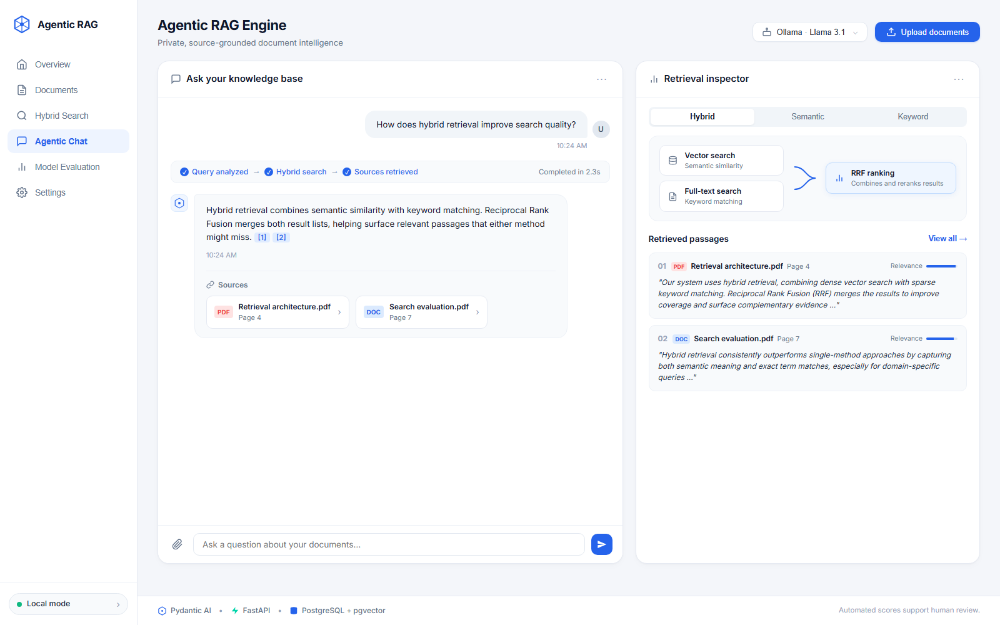
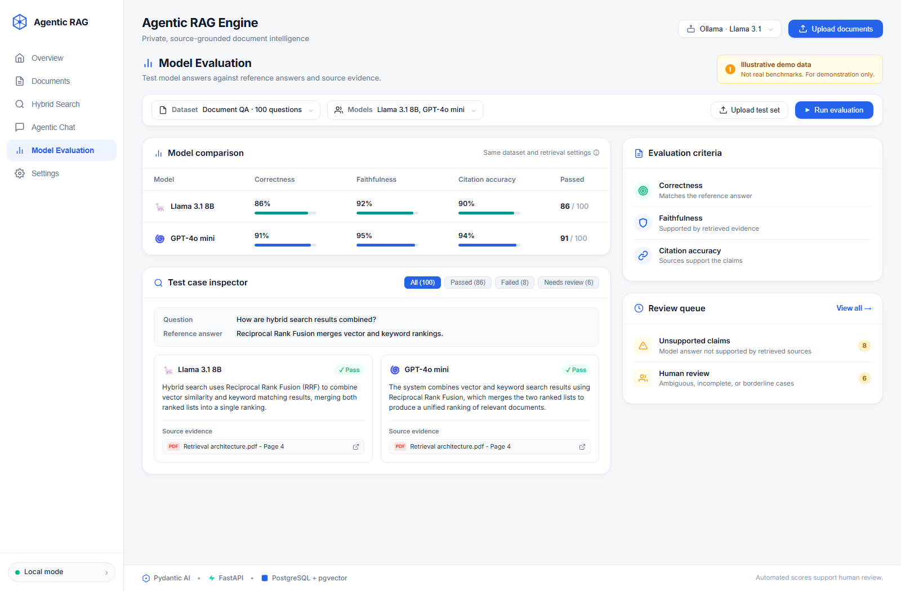

<p align="center">
  <h1 align="center">⚡ Agentic RAG Engine</h1>
  <p align="center">
    <strong>Enterprise-Grade Retrieval-Augmented Generation with Autonomous Agents, Hybrid Search & Local LLMs</strong>
  </p>
  <p align="center">
    
    
    
    
    
    
    
  </p>
</p>

---

A production-ready **Agentic RAG** system that pairs an autonomous AI agent with hybrid vector search, multi-modal document ingestion, and built-in model evaluation. Designed to operate **100% locally and privately** with Ollama and SentenceTransformers — no paid API keys required — with seamless zero-downtime fallback to OpenAI when desired.

---

## 📸 Interface Preview

### 1. Agentic Chat & Grounded Retrieval Inspector
Interact with your private knowledge base in real-time with step-by-step reasoning transparency, interactive source citations, and dynamic Reciprocal Rank Fusion (RRF) inspection.



### 2. Model Evaluation & Benchmark Dashboard
Validate answer quality, reference alignment, context faithfulness, citation accuracy, and hallucination risk across multiple LLMs side-by-side.



---

## 🏛️ System Architecture

```
┌─────────────────────────────────────────────────────────────────────────────┐
│                          Modern Web UI / Client                             │
│       [Agentic Chat]    [Hybrid Search]    [Model Evaluation Dashboard]     │
└──────────────────────────────────────┬──────────────────────────────────────┘
                                       │  HTTP / Server-Sent Events (SSE)
                                       ▼
┌─────────────────────────────────────────────────────────────────────────────┐
│                          FastAPI REST API (:8000)                           │
│  ┌──────────────┐  ┌──────────────────┐  ┌─────────────┐  ┌──────────────┐  │
│  │    /chat     │  │   /chat/stream   │  │  /evaluate  │  │ /search/*    │  │
│  └──────┬───────┘  └────────┬─────────┘  └──────┬──────┘  └──────┬───────┘  │
│         └───────────┬───────┘                   │                │          │
│                     ▼                           │                │          │
│  ┌───────────────────────────────────────┐      │                │          │
│  │          Pydantic AI Agent            │ ◄────┼────────────────┘          │
│  │   (autonomous tool selection & loop)  │      │                           │
│  └──────────────────┬────────────────────┘      │                           │
│                     │                           │                           │
│         Tools: hybrid_search, vector_search,    │                           │
│                list_documents, get_document     │                           │
└─────────────────────┼───────────────────────────┼───────────────────────────┘
                      │                           │
            ┌─────────┴─────────┐        ┌────────┴────────┐
            ▼                   ▼        ▼                 │
     ┌─────────────┐     ┌──────────────────────┐          │
     │ LLM Engine  │     │  Embedding Engine    │          │
     │             │     │                      │          │
     │  • Ollama   │     │ • Sentence-          │          │
     │    (Llama3) │     │   Transformers       │          │
     │  • OpenAI   │     │   (all-MiniLM-L6-v2) │          │
     │    (GPT-4o) │     │ • OpenAI Embeddings  │          │
     └─────────────┘     └──────────┬───────────┘          │
                                    │                      │
                                    ▼                      ▼
                       ┌─────────────────────────────────────────┐
                       │         PostgreSQL 17 + pgvector        │
                       │          (HNSW / IVFFlat Index)         │
                       │                                         │
                       │  • Cosine Vector Similarity (Dense)     │
                       │  • Full-Text Search tsvector (Sparse)   │
                       │  • Reciprocal Rank Fusion (RRF)         │
                       └─────────────────────────────────────────┘
```

---

## ✨ Key Features

| Feature | Description |
|---|---|
| 🖥️ **Modern Executive Web UI** | Clean, responsive interface featuring multi-tab views: Overview, Documents, Hybrid Search, Agentic Chat, and Model Evaluation. |
| 🤖 **Autonomous Agentic Reasoning** | Pydantic AI-powered agent dynamically selects optimal retrieval tools based on query intent. |
| 🔍 **Hybrid Search + RRF** | Merges dense vector embeddings with PostgreSQL sparse full-text search via Reciprocal Rank Fusion. |
| 📊 **Built-in RAG Evaluation Suite** | Measure **Faithfulness**, **Answer Relevance**, **Citation Accuracy**, and **Hallucination Risk** directly via API and UI. |
| 🏠 **Local-First & Privacy Compliant** | Powered entirely by local Ollama models (`llama3.1:8b`, `mistral`) and local embeddings (`all-MiniLM-L6-v2`). |
| 🔐 **Zero-Downtime Cloud Fallback** | Seamlessly switch between local Ollama inference and OpenAI (`gpt-4o`, `gpt-4o-mini`). |
| 🌊 **Real-Time Token Streaming** | Native Server-Sent Events (SSE) for live token generation and tool-execution step updates. |
| 📄 **Enterprise PDF Parsing** | Docling-powered ingestion extracting tables, hierarchical text chunks, and metadata. |
| 💾 **Persistent Session Memory** | Conversation history stored in PostgreSQL with dynamic context-window management. |

---

## 🚀 Quick Start

### Prerequisites

- **Python 3.11** or **3.12**
- **Ollama** (for 100% private local inference) or an OpenAI API key
- **PostgreSQL 17** with `pgvector` extension enabled (local Docker, Postgres native, or cloud services like Neon/Supabase)

---

### 1. Clone & Configure Environment

```bash
git clone https://github.com/GhassenAllouch11236598989898/-agentic-rag-engine.git
cd -agentic-rag-engine
cp .env.example .env
```

Edit `.env` with your PostgreSQL database credentials and preferences:

```env
# Database
DB_HOST=localhost
DB_PORT=5432
DB_NAME=rag_db
DB_USER=postgres
DB_PASSWORD=your_password

# LLM Provider: 'ollama' or 'openai'
LLM_PROVIDER=ollama
LLM_MODEL=llama3.1:8b

# Embedding Provider: 'local' or 'openai'
EMBEDDING_PROVIDER=local
EMBEDDING_MODEL=all-MiniLM-L6-v2
EMBEDDING_DIM=384
```

---

### 2. Install Dependencies

```bash
pip install -r requirements.txt
```

---

### 3. Start Ollama (For Local Inference)

```bash
ollama pull llama3.1:8b
ollama serve
```

---

### 4. Ingest Documents

Drop your PDF or text documents into the `documents/` folder, then run the ingestion pipeline:

```bash
python -m app.ingestion.ingest --documents documents/
```

---

### 5. Start the Server

```bash
uvicorn app.api:app --reload --host 127.0.0.1 --port 8000
```

- **Web Application UI:** [http://127.0.0.1:8000](http://127.0.0.1:8000)
- **Interactive Swagger Documentation:** [http://127.0.0.1:8000/docs](http://127.0.0.1:8000/docs)
- **ReDoc API Reference:** [http://127.0.0.1:8000/redoc](http://127.0.0.1:8000/redoc)

---

## 📖 Web Interface Guide

The web dashboard is served directly by FastAPI at `/`:

- **Agentic Chat (`/` or `#chat`):** Chat directly with your documents. Watch the reasoning process bar (`Query analyzed` → `Hybrid search` → `Sources retrieved`), click interactive citation badges, and inspect retrieved passages in the side inspector.
- **Model Evaluation (`#evaluation`):** Run benchmark test cases against ground truth reference answers. Inspect correctness, faithfulness, and citation support across different LLM backends.
- **Hybrid Search Playground (`#search`):** Test vector similarity vs keyword search directly with adjustable weights.
- **Documents Manager (`#documents`):** View indexed files, chunk counts, and upload new documents directly through the UI modal.

---

## 🔌 API Reference

### Core Endpoints

| Method | Endpoint | Description |
|---|---|---|
| `GET` | `/` | Serves the web application interface |
| `GET` | `/health` | System health check (DB connectivity, providers) |
| `POST` | `/chat` | Non-streaming chat with tool execution and automatic RAG evaluation |
| `POST` | `/chat/stream` | Streaming chat via Server-Sent Events (SSE) with tool events |
| `POST` | `/search/vector` | Standalone dense vector similarity search |
| `POST` | `/search/hybrid` | Standalone hybrid search with Reciprocal Rank Fusion |
| `POST` | `/evaluate` | Standalone evaluation endpoint for query-response-context triplets |
| `GET` | `/documents` | List indexed documents and metadata |
| `GET` | `/sessions/{id}` | Retrieve past session conversation history |

### Example: Agentic Chat (cURL)

```bash
curl -X POST http://127.0.0.1:8000/chat \
  -H "Content-Type: application/json" \
  -d '{
    "message": "How does hybrid retrieval improve search quality?",
    "search_type": "hybrid"
  }'
```

**Response:**

```json
{
  "message": "Hybrid retrieval combines semantic similarity with keyword matching. Reciprocal Rank Fusion merges both result lists...",
  "session_id": "8f3b2a1c-...",
  "tools_used": [
    {
      "tool_name": "hybrid_search",
      "args": {"query": "hybrid retrieval search quality", "limit": 5}
    }
  ],
  "evaluation": {
    "faithfulness": 0.94,
    "answer_relevance": 0.92,
    "hallucination_risk": "low"
  }
}
```

### Example: Standalone Evaluation (cURL)

```bash
curl -X POST http://127.0.0.1:8000/evaluate \
  -H "Content-Type: application/json" \
  -d '{
    "query": "What is Reciprocal Rank Fusion?",
    "response": "RRF combines the ranked lists of multiple retrieval algorithms into a single unified ranking.",
    "contexts": [
      "Reciprocal Rank Fusion (RRF) is a method that combines multiple search result lists to produce a single ranking."
    ]
  }'
```

---

## ⚙️ Configuration Reference

All settings can be customized in your `.env` file:

| Variable | Default | Description |
|---|---|---|
| `LLM_PROVIDER` | `ollama` | `ollama` for local inference or `openai` |
| `LLM_MODEL` | `llama3.1:8b` | Ollama model name (e.g. `llama3.1:8b`, `mistral`) |
| `EMBEDDING_PROVIDER` | `local` | `local` (SentenceTransformers) or `openai` |
| `EMBEDDING_MODEL` | `all-MiniLM-L6-v2` | SentenceTransformer embedding model name |
| `EMBEDDING_DIM` | `384` | Must match model vector output dimension |
| `OPENAI_API_KEY` | — | Required only if `LLM_PROVIDER=openai` or `EMBEDDING_PROVIDER=openai` |
| `DB_HOST` | `localhost` | PostgreSQL host |
| `DB_PORT` | `5432` | PostgreSQL port |
| `DB_NAME` | `rag_db` | Database name |
| `DB_USER` | `postgres` | Database user |
| `DB_PASSWORD` | `postgres` | Database password |
| `APP_PORT` | `8000` | FastAPI server port |

---

## 🧪 Testing

Run the automated test suite:

```bash
pytest
```

---

## 🛠️ Tech Stack

- **Agent Orchestration:** [Pydantic AI](https://ai.pydantic.dev/)
- **API Framework:** [FastAPI](https://fastapi.tiangolo.com/) + Uvicorn
- **Vector Database:** [PostgreSQL 17](https://www.postgresql.org/) + [pgvector](https://github.com/pgvector/pgvector)
- **Local LLM Engine:** [Ollama](https://ollama.ai/)
- **Embeddings:** [SentenceTransformers](https://sbert.net/) (`all-MiniLM-L6-v2`)
- **Document Extraction:** [Docling](https://github.com/DS4SD/docling)
- **Frontend:** Vanilla HTML5, Modern CSS (Glassmorphism & Micro-animations), Responsive JavaScript (Zero heavy bundlers needed)

---

## 📄 License

This project is licensed under the MIT License - see the [LICENSE](LICENSE) file for details.
